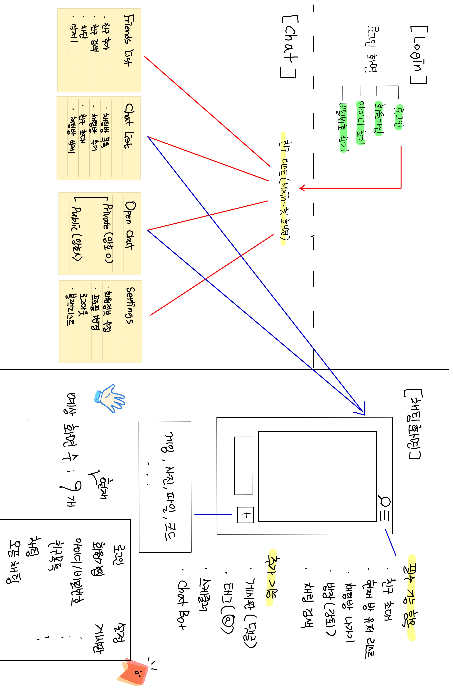

# 07.26 (월) 회의록

    작성자 : [Dr]우성

> 회의 주제

- Flow 구상 및 설계

> 결정 사항

1. 회의록 작성

   a. 팀원 번갈아가며 작성  
   b. 당일 회의록 작성자 커밋 규칙과 함께 document repo에 commit 할 것.

2. JWT, Radis Repository 추가 생성
3. Flow 설계 (아래 그림 참고)

## 

> Next meeting

- 다음 회의록 작성자 : [Tho] 대헌
- Template Search

- **_주제 : 기술 스택 리스트 결정하기_**
