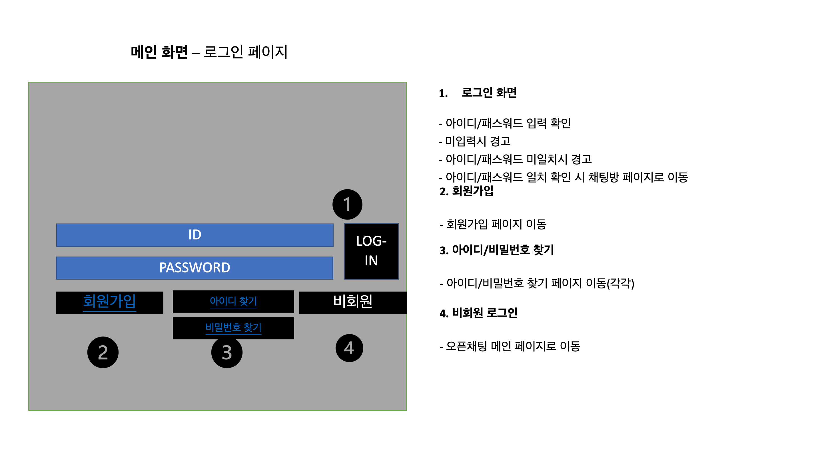
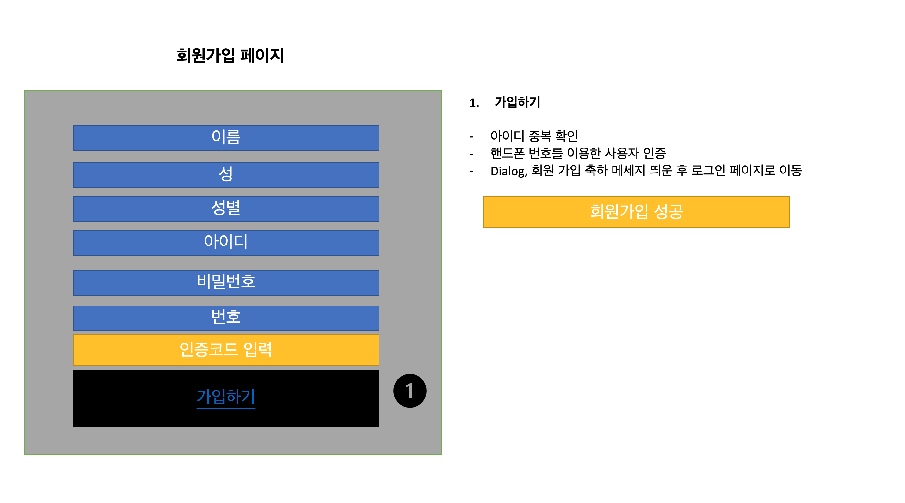
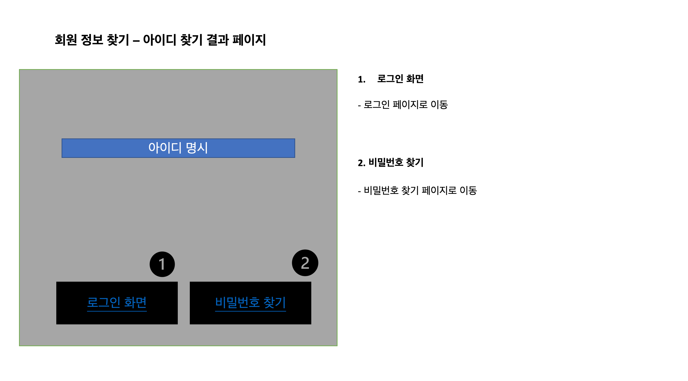
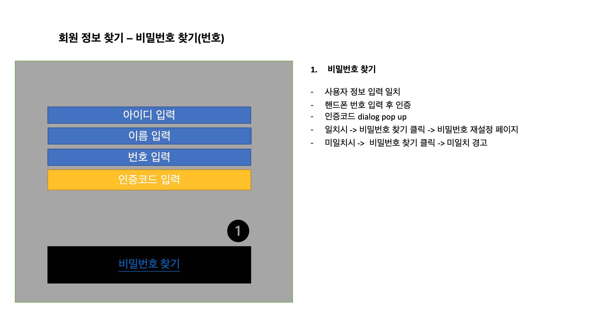
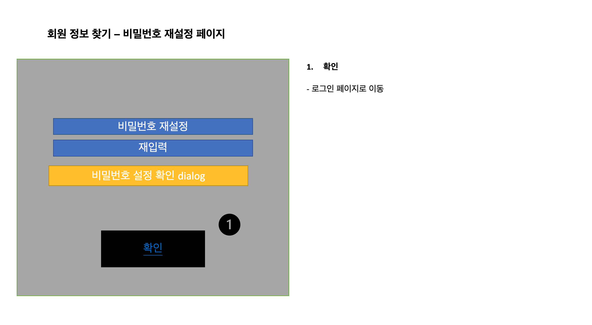

# 07.28 (수) 회의록

    작성자 : [Hulk]재현

> 회의 주제

1. 서버 구축 [MYSQL 설치]
    ```
    1-1. mysql server - community downloads
    1-2. 차례대로 설치 진행
        - options: server computer 설정
        - PW: <del>"zhqpswutm400"</del>
    1-3. cmd or terminal에서 mysql 접속 
    1-4. 유저 생성 및 권한 부여하기[CHAT]

    * 외부 접속 방법 고려해야함.
   ```
2. redis 설정
    ```
    2-1. dbeaver 통해서 드라이버 설치 후, 사용하려 햇으나 licence 허가X
    2-2. redis-cli 를 통하여 command line을 통하여 사용하기로 결정
    ```
  
3. file 공유
    ```
    3-1. FileZila 프로그램을 사용하여 ftp로 파일 공유환경 설정
    3-2. 속도 문제로 좋은 방안 모색중
    ```
4. 스토리 보드 작성 [작성 진행중]

## 
## 
## 
## 
## 

> Next meeting

- 다음 회의록 작성자 : [Captain] 유진

- **_주제 : 스토리보드 작성하기 _**
