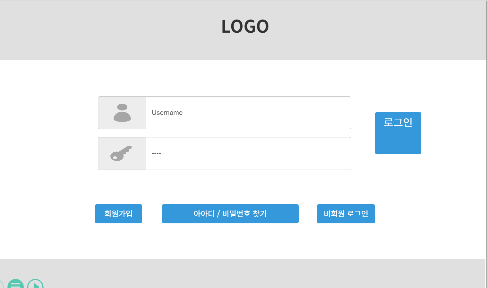
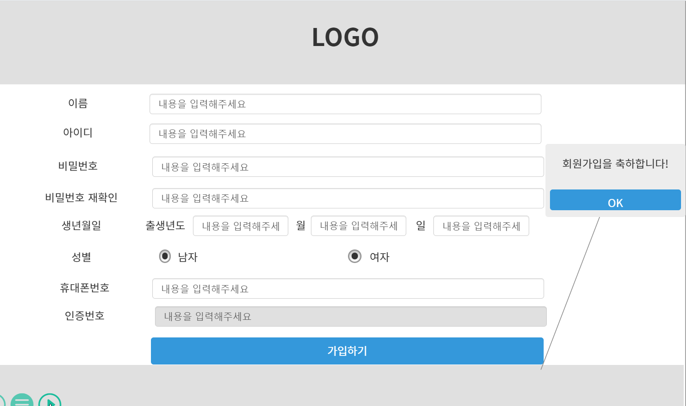
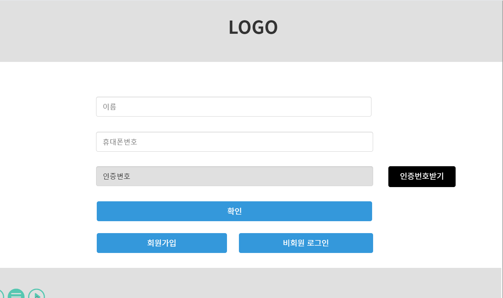
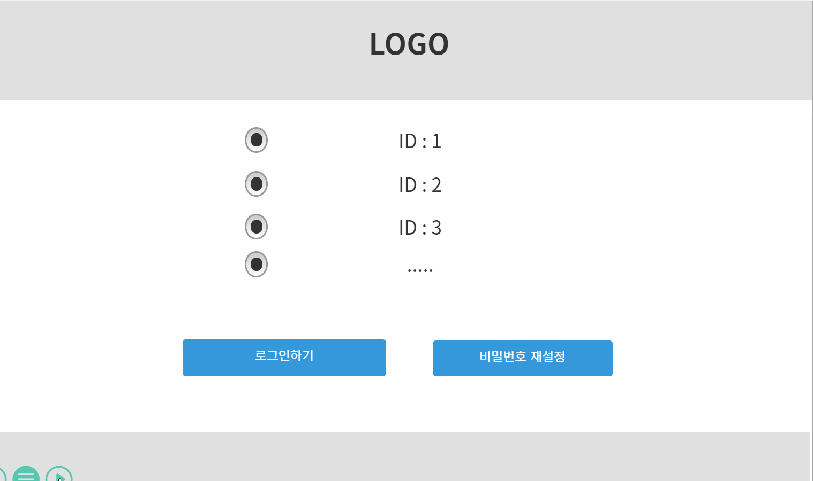
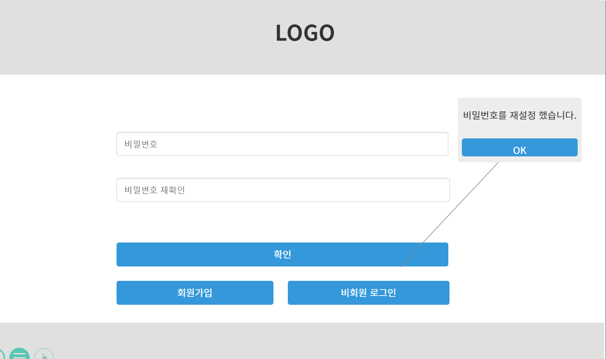

# 07.29 (목) 회의록

    작성자 : [Captain]유진

> 회의 주제

- 스토리보드 작성(로그인, 회원가입, 아이디/비밀번호 찾기) : oven 이용

> 결과

1. [oven](https://ovenapp.io/) 사용

2. 아이디/비밀번호 찾기 과정 수정
    - original
      - 아이디/비밀번호 찾기 페이지 따로 만들기
    - current
      - [아이디/비밀번호 찾기 버튼 클릭] -> [인증페이지(휴대폰 번호로)] -> [가입한 아이디 목록] -> [비밀번호 재설정 페이지]

3. 작성 페이지

    |로그인|회원가입|아이디/비밀번호찾기|가입한 아이디 목록 페이지|비밀번호 재설정 페이지|
    |:---:|:---:|:---:|:---:|:---:|
    ||||||

> Next meeting

- 다음 회의록 작성자 : [Captain] 유진
- 현재 스토리보드 description 작성
- 강사님과 미팅

- **_주제 : 스토리보드 챗방 시작_**
